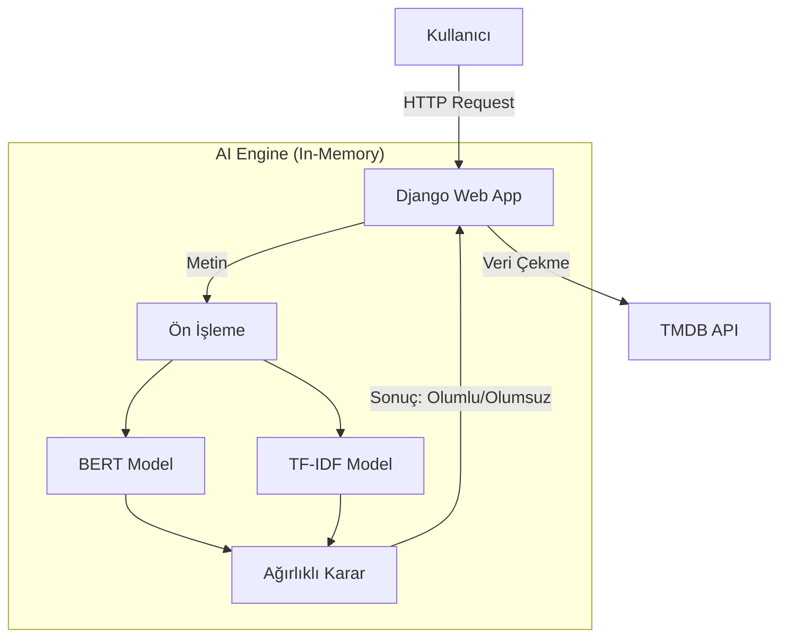
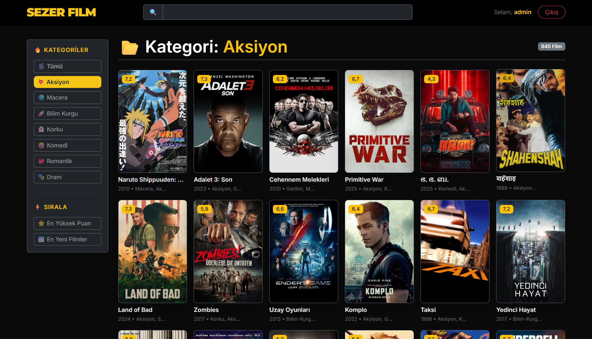
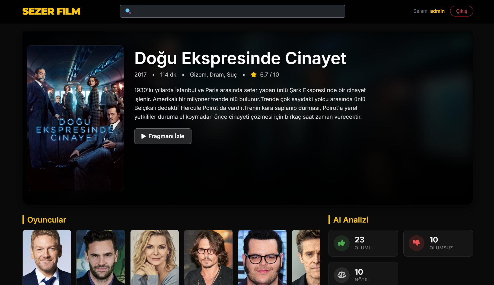
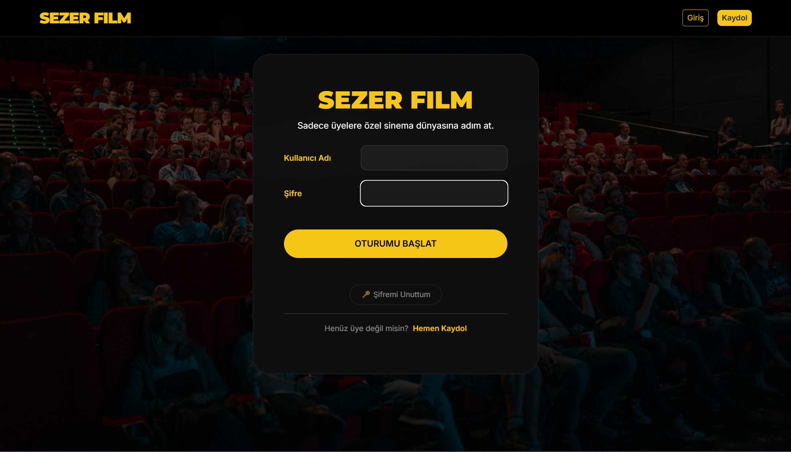
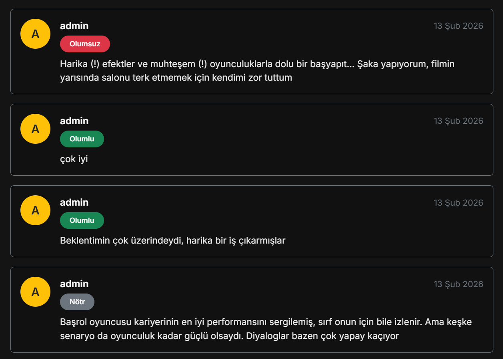
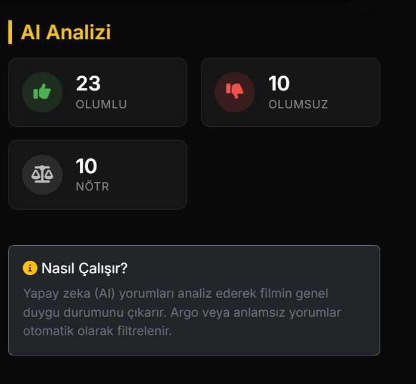
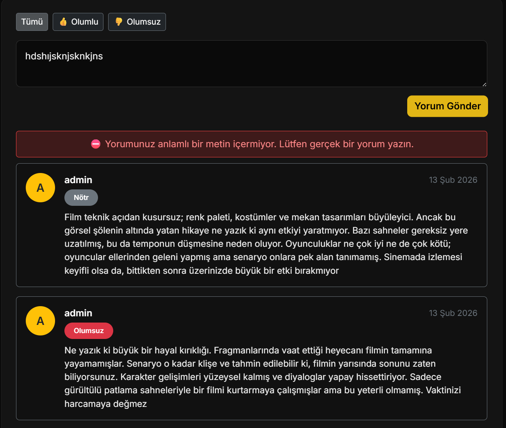

# 🎬 Sezer Film - AI Destekli Film Analiz Platformu
### Turkish Movie Review Sentiment Analysis with BERT + TF-IDF Ensemble

**AI destekli, Türkçe film yorumları üzerinde hibrit duygu analizi yapan ve TMDB API ile zenginleştirilmiş modern bir film analiz platformu.**


## 🌐 Canlı Demo

🔗 **Demo:** https://turkish-movie-review-sentiment.onrender.com


> **⚠️ Önemli Not (Render Free Tier Sınırlamaları):**
> Bu proje, **Render.com'un Ücretsiz (Free Tier)** sunucularında barındırılmaktadır. Bu sunucular sadece **512 MB RAM** ve paylaşımlı CPU gücü sunmaktadır. Projede kullanılan **BERT** tabanlı Yapay Zeka modeli oldukça büyük olduğu için bu donanım sınırlarını zorlamaktadır.
>
> Bu kısıtlamalar nedeniyle:
> 1.  **Açılış Hızı:** Sunucu kullanılmadığında uyku moduna geçer, uyanması **1-2 dakika** sürebilir.
> 2.  **Yavaş İlk Analiz:** Model belleğe (RAM) sığmak için özel sıkıştırma (Quantization) teknikleriyle yüklenir. İlk yorum yapıldığında modelin diskten okunup RAM'e yüklenmesi **3-4 dakika** sürebilir. Sonraki analizler hızlıdır.
> 3.  **Veri Kalıcılığı:** Ücretsiz disk (Ephemeral) kullanıldığı için sunucu her yeniden başladığında veritabanı sıfırlanır (Otomatik olarak yeniden film çekilir).
>
> 💡 **Tavsiye:** *Tam performanslı ve kesintisiz bir deneyim için projeyi kendi bilgisayarınıza klonlayıp çalıştırmanız önerilir.*


## ✨ Özellikler

- **🚀 Direct AI Integration:** Direct Mode mimarisinde AI modelleri Django uygulaması içinde bellek üzerinde yüklenir ve inference işlemleri doğrudan Python katmanında gerçekleştirilir.
- **🕷️ Veri Madenciliği:** TMDB API entegrasyonu ile binlerce film verisi ve posteri otomatik olarak çekilir.
- **🧠 Hibrit Duygu Analizi:** Yorumlar; Derin Öğrenme (BERT), Makine Öğrenmesi (TF-IDF) ve Kural Tabanlı sistemlerin ağırlıklı ortalaması ile analiz edilir.
- **🎨 Modern Arayüz:** Responsive tasarım, Netflix tarzı Hero Carousel ve dinamik ızgara (Grid) yapısı.
- **🔒 Güvenlik:** `.env` yönetimi ve CSRF korumaları.

## 🧠 Kullanılan AI Modeli

Duygu analizi sistemi **3 sınıflı (Olumlu / Nötr / Olumsuz)** sınıflandırma yapacak şekilde eğitilmiştir.

**Model Künyesi:**
* 📦 **Model Versiyonu:** `benim_bert_modelim_3cls_v2`
* 🤖 **Mimari:** Fine-tuned BERT (`dbmdz/bert-base-turkish-cased`)
* 📊 **Yardımcı Model:** TF-IDF + Logistic Regression (Not: `film_tfidf_3cls.pkl`, ~10MB boyutu ve deployment tutarlılığı için repo'ya dahil edilmiştir.)
* 🛡️ **Guardrails:** İroni, Spam ve Anlamsız Metin Filtresi

🚀 **Veri Seti:** Model, **Beyazperde** ve diğer kaynaklardan toplanan **190.000+ satırlık** temizlenmiş Türkçe film yorum veri seti ile eğitilmiştir.

## 🔄 AI Analiz Akışı

1. **Giriş:** Kullanıcı yorumu Django view katmanına ulaşır.
2. **Ön İşleme:** Metin temizlenir (noktalama, lower-case) ve Guardrail kontrolünden geçer.
3. **Derin Analiz:** Fine-tuned BERT modeli metnin bağlamını (context) analiz eder.
4. **İstatistiksel Analiz:** TF-IDF modeli kelime köklerini ve frekanslarını değerlendirir.
5. **Karar (Ensemble):** Her iki modelin çıktıları ağırlıklı bir algoritma ile birleştirilerek nihai karar verilir.

## 🏗️ Proje Mimarisi (Direct Mode)

Bu projede mikroservis karmaşası yerine, performans ve yönetim kolaylığı için **Monolithic AI** yaklaşımı benimsenmiştir.




```text
┌──────────────────────────┐
│      Django Web App      │
│   (UI + Backend + AI)    │
│            │             │
│   ┌──────────────────┐   │
│   │ AI Ensemble Core │   │
│   │ - Fine-tuned BERT│   │
│   │ - TF-IDF + LR    │   │
│   │ - Guardrails     │   │
│   └──────────────────┘   │
│            │             │
│   TMDB API v3 (Film Data)│
└──────────────────────────┘
```

## 📸 Ekran Görüntüleri

Projenin arayüzünden bazı kareler:


| Ana Sayfa | Film Detay |
|-----------|------------|
|  |  |

| Kullanıcı Giriş | Yorumlar & Analiz |
|-----------------|-------------------|
|  |  |

| AI Analiz Dashboard | Spam Koruması |
|---------------------|---------------|
|  |  |

## 🛠️ Kurulum (Local Development)

Projeyi kendi bilgisayarınızda çalıştırmak için:

1. **Repoyu klonlayın:**
   ```bash
   git clone https://github.com/erensezer07-gif/turkish-movie-review-sentiment.git
   cd turkish-movie-review-sentiment
   ```

2. **Sanal ortamı kurun:**
   ```bash
   python -m venv .venv
   # Windows:
   .venv\Scripts\activate
   # Mac/Linux:
   source .venv/bin/activate
   ```

3. **Bağımlılıkları yükleyin:**
   ```bash
   pip install -r requirements.txt
   ```

4. **Modeli indirin:**
   ```bash
   python scripts/download_model.py
   ```
   > ⚠️ **Not:** Model yaklaşık 400MB boyutundadır. İndirme tamamlanmadan proje çalışmaz.

5. **Ortam değişkenlerini (.env) ayarlayın:**
   Projeyi çalıştırmak için ana dizinde `.env` dosyası oluşturun:
   ```ini
   SECRET_KEY=gizli_anahtariniz
   DEBUG=True
   TMDB_API_KEY=tmdb_api_key_buraya
   ```

6. **Veritabanını hazırlayın:**
   ```bash
   python manage.py migrate
   ```

7. **Örnek verileri çekin:**
   Veritabanını doldurmak için (örneğin 1 sayfa film):
   ```bash
   python manage.py film_cek 1
   ```

8. **Sunucuyu başlatın:**
   ```bash
   python manage.py runserver
   ```
   Adres: http://127.0.0.1:8000

## 📦 Dependency Yönetimi

Bu projede bağımlılıklar standartlaştırılmıştır ve **pip-tools** ile yönetilmektedir.

### 1. Kurulum Standardı (Local / CI / Prod)
Tüm ortamlar için tek geçerli kurulum komutu şudur:
```bash
pip install -r requirements.txt
```
> ⚠️ **UYARI:** `requirements.txt` dosyası asla elle düzenlenmemelidir. Bu dosya otomatize bir süreçle kilitlenmiştir (pinned & hashed).

### 2. Paket Ekleme/Çıkarma
Yeni bir paket eklemek veya çıkarmak için:
1. `requirements.in` dosyasını düzenleyin.
2. Lock dosyasını güncelleyin:
   ```bash
   pip-compile --generate-hashes requirements.in -o requirements.txt
   ```
3. Değişiklikleri yükleyin:
   ```bash
   pip-sync
   # veya
   pip install -r requirements.txt
   ```

### 3. Güncelleme Politikası (Routine Bump)
Bağımlılıklar **aylık veya 2 aylık periyotlarla** güncellenmelidir.

**Örnek Güncelleme Komutları:**
```bash
# Tüm paketleri güvenli aralıkta güncelle
pip-compile --upgrade requirements.in -o requirements.txt

# Sadece belirli bir paketi güncelle (Ör: Django)
pip-compile --upgrade-package django --generate-hashes requirements.in -o requirements.txt

# Birden fazla paketi güncelle
pip-compile --upgrade-package transformers --upgrade-package torch --generate-hashes requirements.in -o requirements.txt
```

### 4. Doğrulama (CI Check)
Her güncelleme sonrası mutlaka testler çalıştırılmalıdır:
```bash
python manage.py test
```

## 👨‍💻 Geliştirici

**Eren Sezer**
Computer Engineering Student | AI & NLP Enthusiast
